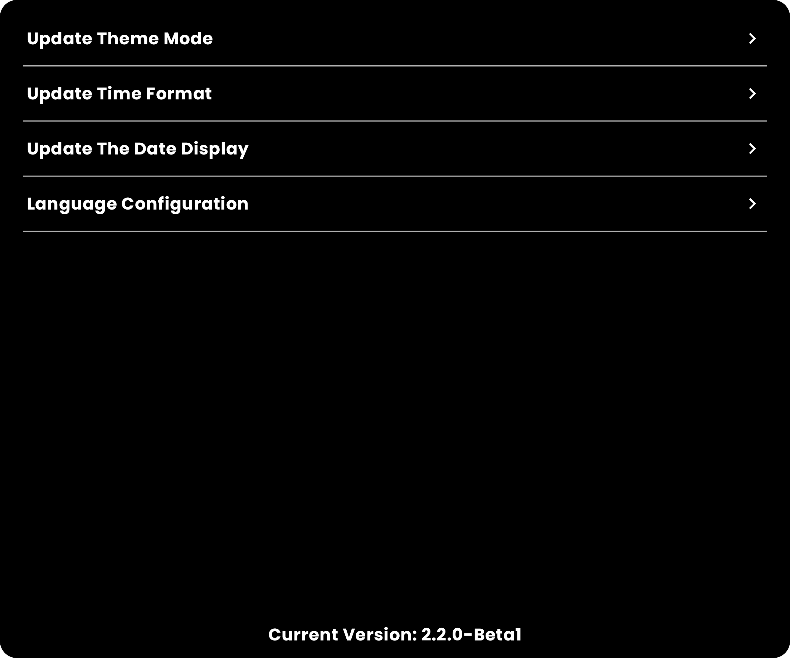
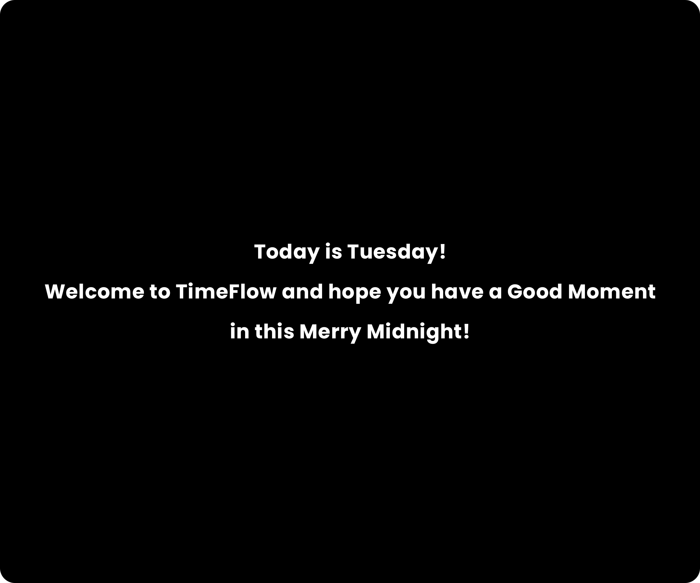
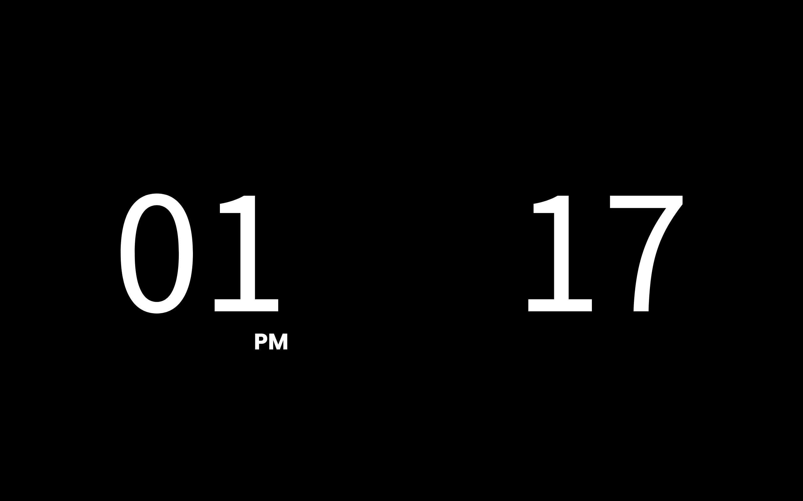

TimeFlow, an APP you can use to show the time when you are focused on studying, work, etc.

跳转到[简体中文README.md](README_CN.md)

### Project

- If you don't have any interests in Android or other frontend platform, ignore the project introduction(the sharing of tech details).
- Modified from [TimeFlow](https://github.com/DIPENG-XU/TimeFlow), but the old project coded by View, in this new project, I choose Jetpack Compose to build the UI. (A new UIFramework when build the UI for Android)
- Besides, I use the Automatic injection framework to generate something, which is easier to build the code.
- Recode the ViewModel, which is more suitable from Jetpack Compose when I need to use the state in the UI.

### Why design and develop it?

- The mainly reason is when I stayed at school, there are lots of students used such an app in their
  iPad when studying. I think it's useful when you focus on your work, you can feel how your time
  flow. And that's the reason why I name it as TimeFlow.
- And it's easy to find such an app in App Store but Android any Stores, even you can, the app is
  also full of ads.
  I think it's a bad experience to see ads or other useless information when using the Time app.
  You should only focus on your thing and notice your time.
- So as an Android Tablet user and an Android developer, I though it was a great time that I should
  try to design and develop it.
- If you have any better ideas or find any bugs, you
  can [pull the issue](https://github.com/DIPENG-XU/TimeFlow-By-Compose/issues/new) to me. When
  leisure, I will reply you. If I think it's interesting enough and I happen to be capable, I will
  code it for you.

### Statement

- There are no permission this app request, including Network or other local storage permission.
- This app is absolutely free and keep open source. NO CHARGE and NO AD!

### UX

- ~~This point is very important, because there are no instructions on how to use it in the APP.~~
  ~~You can only find and know it from this document.~~
- ~~It is a simple card consisting of two fields: clock and minute~~
    - ~~Click on the card of the clock to choose your favourite time format.~~
    - ~~Click on the minute card to choose whether to display the current date. (Show the date
      Card)~~
    - ~~In Version 2.1.0, click on the date card to switch theme. Now there are only two theme,
      Light and Dark, and I will support more themes next.~~
- In version 2.2.0, I edit the UX. When click on the card of clock, it will navigate to a setting
  page, which will help you to config this app.
  
  - In this Page, you can update theme mode, time format the date display and language. Now, It only support English, Simplify Chinese and Traditional Chinese. If you want to support more language(such as your regional language), you can [pull the issue](https://github.com/DIPENG-XU/TimeFlow-By-Compose/issues/new) with your translation to me. Here's what you need to translate. And Thanks your help.
    - **The Current State is:**
    - **The New State will be:**
    - **Update Theme Mode**
    - **Light Mode**
    - **Dark Mode**
    - **Update Time Format**
    - **12-hour Base**
    - **24-hour Base**
    - **Update The Date Display**
    - **Open**
    - **Close**
    - **Current Version**

- Have Added a Launch Page in Version 2.2.4, I think it's more romantic when using such an tool app.
  - It's the Previews
  

### Effect Pictures

There are all the effect pictures.

- Tablet: Time format Base on 12
  

- In addition, [there](show_img) are other effects preview.