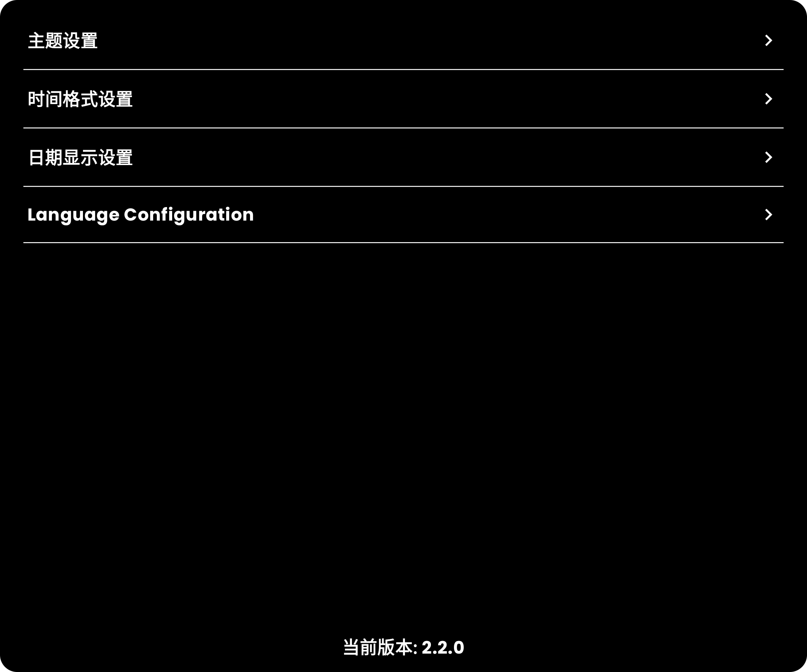
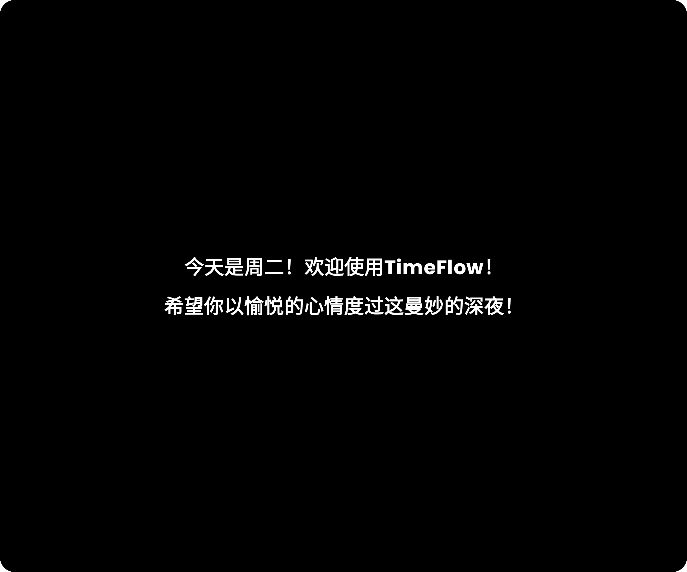

### 项目

- 由[TimeFlow](https://github.com/DIPENG-XU/TimeFlow)迁移而来。
- 你如果不玩大前端的开发，不用里面这部分的描述，这里都是一些关于技术细节的介绍。
- 原项目使用使用View体系布局，这种方式已经跟不上时代了，我自己不跟着大家卷两下就难受，
  于是改用Jetpack Compose声明式UI布局的方式去重新构建这个新项目。
- 这个项目采用了更加合适于Compose的ViewModel注入方式去创建ViewModel。
- 以及使用了State替代了原来的数据通知方式，还有就是调整了一下数据格式，其他不变。

### 为什么设计和构建这个APP?

- 起初是因为当时还在学校的时候，看到那帮用iPad的同学经常用平板当成时钟放在隔壁，感觉挺有学习氛围的。
- 但苦于我是Android设备爱好者，在Play Store、三星APP商店还有小米APP商店这些地方下载，那些APP花里胡哨的内容和广告都非常多，需要一大堆的权限，超级离谱。
  我个人觉得，（免费无广告的别人写好的软件 > 能够一次性购买的无广告软件 > 自己写的软件 >
  订阅制无广告软件 > 广告软件），在这条优先链下，我只能自己设计和写代码。

### 免责申明

- 这个APP没有申请任何网络权限，所有存储的内容都是在你自己的手机上面（比如你选择了24小时进制或者暗色主题等等，下次进来它会记住你的选择这种）。
- 这个APP完全免费及开源，没有任何付费操作，也没有任何广告内容。

### 用户交互

- 就是比较单纯的两张卡片分别包含时钟和分钟两个字段组成
    - ~~点击时钟的卡片，可以切换时间查看的进制。~~
    - ~~点击分钟的卡片，可以选择是否显示当前的年月日（日期卡片出现）。~~
    - ~~在2.1.0版本后加入新的交互逻辑，点击日期卡片，可以切换主题，目前仅支持两个主题，亮色主题和暗色主题，后续会在这个基础上做其他的增加。~~

- 2.2.0版本对用户交互做了修改，可以修改的内容放在了一个单独的页面里面去配置。
  
    - 当然如果你觉得这种用户交互方式很花里胡哨没必要，还是喜欢之前的那一套逻辑，用[旧版本](https://github.com/DIPENG-XU/TimeFlow-By-Compose/releases/tag/v-2.1.2)也是可以的。

- 2.2.4版本增加了一个启动页，我觉得这个启动页加了之后，这个APP变得更浪漫了。
    - 预览图
    

- 如果你有更好的UX交互逻辑或者什么有意思的想法，随时issue联系我，在[这里](https://github.com/DIPENG-XU/TimeFlow-By-Compose/issues/new)提出来就可以了，我有空然后也觉得你的想法有意思而且我又会做的话，我随时会新增加你需要的功能。

### 效果图

- 看上面，语言虽然有差异，但是图片应该也能够传递出去我所想表达的内容了，这里就不复述了